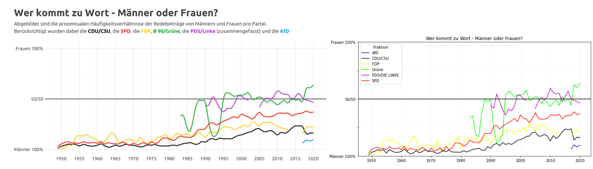

# f**ai**rmocracy.

*Dieses Repository ist Teil unserer Bewerbung für die zehnte Runde des [Prototype Fund](https://prototypefund.de/).*

Wie gerecht ist politische Sprache? Inklusive Sprache wird viel diskutiert, aber sind sich genug Politiker:innen ihrer Vorbildfunktion bewusst, die sie mit jedem gesprochenen Wort ausüben? 

Das Ziel von f**ai**rmocracy ist es, eine Auseinandersetzung mit Social Bias in der deutschen Sprache für alle zugänglich zu machen. Social Bias bezeichnet hierbei eine systematische Diskriminierung von Personengruppen. Wir untersuchen alle Reden, die seit 1949 im Bundestag gehalten wurden, auf syntaktische und semantische Merkmale der Diskriminierung. Der Open Discourse Datensatz stellt diese Reden in maschinenlesbarer Form öffentlich bereit. Für unsere Analysen verwenden wir statistische Methoden, sowie künstliche Intelligenz, die uns hilft, Wörter und ihre Semantik kontextualisiert zu betrachten.

## Die Herausforderung

Der Bundestag ist das Herzstück unserer Demokratie. Es ist das einzige auf Bundesebene direkt gewählte Verfassungsorgan, in dem die Vertreter:innen den Willen des Volkes in geschriebenes Gesetz gießen. Dabei sollten diese unsere ethischen Werte repräsentieren, insbesondere Gleichberechtigung leben und propagieren. Inklusive Sprache ist ein wichtiger Baustein, um auch sprachlich alle in die Politik miteinzubeziehen.

Die Plenarsitzungen werden seit Implementierung der Bundesrepublik protokolliert und sind öffentlich zugänglich, um Teilhabe zu ermöglichen. Open Discourse hat erstmals alle Protokolle für Maschinen lesbar gemacht und befreit uns von langwierigen manuellen Analysen. Als Gruppe von Expert:innen für künstliche Intelligenz, speziell auf dem Gebiet des Natural Language Processing, wollen wir den Datensatz nutzen, um zu erforschen, wie gerecht politische Sprache ist. Gerechtigkeit spiegelt sich sowohl in der Syntax wider, z.B. durch geschlechtergerechte Personenbezeichnungen, als auch in der Semantik, z.B. durch den Kontext, in dem Personengruppen genannt werden. Eine Analyse beider sprachlicher Ebenen lässt uns verstehen, wie sich der politische Diskurs im Laufe der Zeit gewandelt hat und welche Hürden die politische Sprache auch heute noch nehmen muss, um gerecht gegenüber allen Menschen zu werden.

## Unsere Lösung

Der Open Discourse Datensatz umfasst 896.250 Redebeiträge aus den letzten 71 Jahren. Um aus diesen Datenmengen Schlüsse ziehen zu können, verwenden wir im ersten Schritt statistische Methoden, um z.B. den relativen Redeanteil von Frauen und Männern zu erfassen oder zu zählen, wie oft ein bestimmtes Wort in den Reden verwendet wird. Dies ist ein wichtiger erster Schritt, jedoch fehlt eine semantische Analyse des gesprochenen. So wird z.B. noch nicht berücksichtigt, dass ein Wort in positivem oder negativem Kontext stehen kann. Deshalb nutzen wir im zweiten Schritt tiefe neuronale Netze, die darauf spezialisiert sind, Wörter kontextualisiert zu betrachten. Dadurch erhalten wir einen Einblick in die eigentliche Semantik des Gesprochenen. Für jeden gesprochenen Satz wird mithilfe des Netzwerks ein Vektor erstellt. Darauf wenden wir Cluster-Algorithmen an, um Vektoren in Gruppen unterteilen, die unterschiedliche Themenfelder aufzeigen sollen. Dieses Vorgehen wird als Topic Modeling bezeichnet. Daneben entwickeln wir auch Klassifikationsmodelle für das Bestimmen von negativer und positiv konnotierter Sprache, um so gezielt zu untersuchen, wie inklusiv politische Sprache (geworden) ist.

## Aktueller Stand

Für unseren Prototyp haben wir uns bereits mit dem Datensatz vertraut gemacht. So haben wir in einem Jupyter Notebook einen Graphen von Open Discourse repliziert, in dem der relative Redeanteil von Frauen und Männern in den unterschiedlichen Fraktionen über die Jahre dargestellt ist. Die semantische Analyse der Texte, sowie eine interaktive Darstellung der Ergebnisse werden vollständig im Rahmen des Prototyps implementiert.
